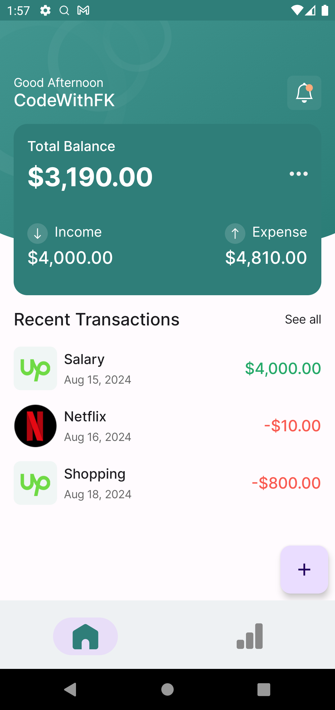
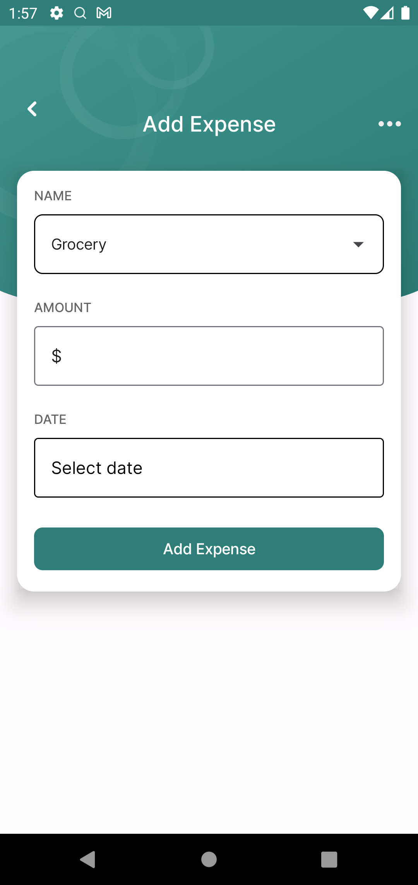
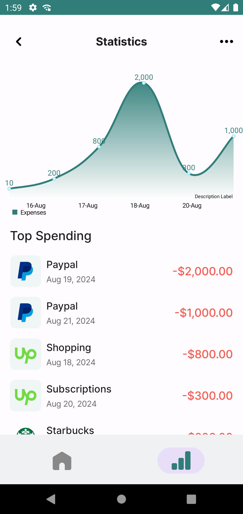

# 💸 Expense Tracker Android App

Welcome to the **Expense Tracker Android app**!  
This application helps users **track, manage, and analyze their daily expenses** using a clean UI and detailed statistics. Built as part of a **4-week internship** at **CODTECH IT SOLUTIONS**, it follows modern Android development practices.

---

## 👨‍💻 Internship Details

- **Company:** CODTECH IT SOLUTIONS  
- **Name:** Ganesh  
- **Intern ID:** CT04DF511  
- **Domain:** Android Development  
- **Duration:** 4 Weeks  
- **Mentor:** Neela Santosh  

---

## ✨ Features

- ✅ **Add Expense** – Quickly log your daily spending.
- ✅ **View History** – All expenses are listed chronologically.
- ✅ **Categorize Spending** – Tag expenses (Food, Travel, Bills, etc.).
- ✅ **Analyze Stats** – View spending patterns with graphs and insights.
- ✅ **Edit/Delete Entries** – Modify or remove any expense.

---

## 🔧 Technologies Used

| Layer | Technology |
|-------|------------|
| UI    | **Jetpack Compose** – Modern declarative UI toolkit |
| Database | **Room** – SQLite abstraction layer for local data |
| DI    | **Dagger Hilt** – Dependency injection framework |
| Architecture | **MVVM** – Clean separation of concerns |
| Charting | **MPAndroidChart** – Visual representation of data |

---

## 📸 Screenshots

| Home Screen | Add Expense | Stats |
|-------------|-------------|-------|
|  |  |  |

---

## 🚀 Getting Started

### ✅ Prerequisites

- Android Studio **Bumblebee or newer**
- **Java 11** or later
- **Android SDK 21** or higher

### 🛠 Installation Steps

1. Clone the repository:
   ```bash
   git clone https://github.com/yourusername/ExpenseTrackerAndroid.git
